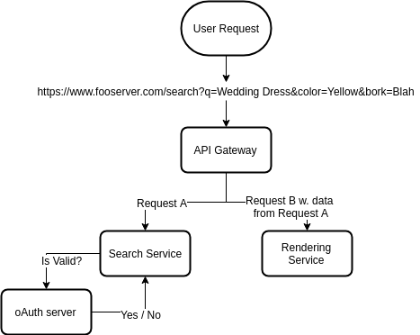

# Architecture

Given this task is only a conceptual test, the architecture is a bit "freehand".

However, the task was to build a microservice that handles search with optional additional filtering. Given this,
an (absudly) simple application that requires such a service might look like:

There are a couple of things that are worth noting about this design:

## Centralised authentication

The search service should not have its own pool of users. Instead, users should be centrally managed by a single server
with notion of who has access to what.

There are various ways of doing this, but here oAuth has been chosen as it's fairly simple to implement, stateless and
has the primitive of "scopes" which can be used for ACLs.

Additionally, while the search data is not private the requirements were to implement authentication. Accordingly, both
read and write calls require oAuth, and it's presumed the API Gateway will do arbitrary transformations to shape the
client request to the search service request.

## No Data Pools

Here, each service is not pictured with it's "data pool" such as ElasticSearch, MySQL or LDAP. This is primarily because
when implementing such a framework services should not communicate via these pools, instead only communicating via the
APIs exposed on each application.
